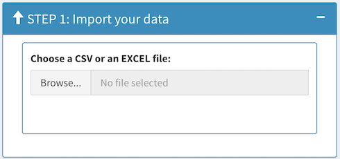
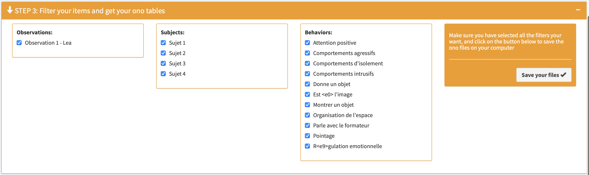

<!-- README.md is generated from README.Rmd. Please edit that file -->

```{r, include = FALSE}
knitr::opts_chunk$set(
  collapse = TRUE,
  comment = "#>",
  fig.path = "man/figures/README-",
  out.width = "100%"
)
```


# onoBuilder

<!-- badges: start -->

[](https://lifecycle.r-lib.org/articles/stages.html#stable)
[](https://CRAN.R-project.org/package=onoBuilder)
<!-- badges: end -->

This is a tool to use on R with which you can convert qualitative data to quantitative data (in occurrences/non-occurrences - ono) to make a frequency profile analysis.
Basically, it was created for files extracted from The Observer. But you can import any csv or excel file.

## Installation

You can install onoBuilder from [GitHub](https://github.com/) with:

``` r
# install.packages("devtools")
devtools::install_github("thbgrb/onoBuilder")
```
## How to run onoBuilder ?

``` r 
library(runOno)
onoBuilder::runOno()
```

## Use onoBuilder to convert files

### Step 1 

* Browse a **csv** or an **excel** file in your computer.

{width=30%}

* If you import a csv file you can configure specifications of the file.

{width=30%}

* You can visualize content of the data on the right.


### Step 2

* Configure columns name, and then, click on the **next step** button. 

* A start/stop table is created and you can visualize it.


### Step 3

* By default, all observations, all subjects and all behaviors are selected. You can change this in the box. 

* Finally, you can download ono files on your computer by clicking on **save your files** button.



## Do the Frequency Profile analysis

You have to run the frequency profile tool on R

``` r 
require(FreqProf)
FreqProf::runEx()
```

Then, you can use ono files downloaded in FreqProf.