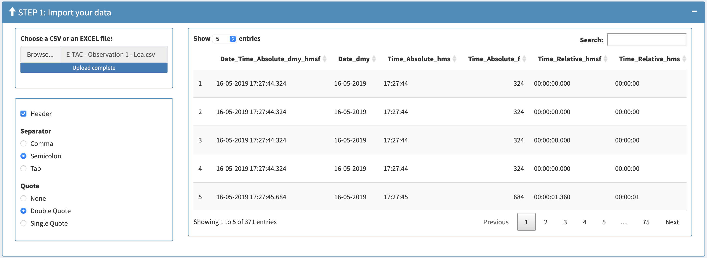
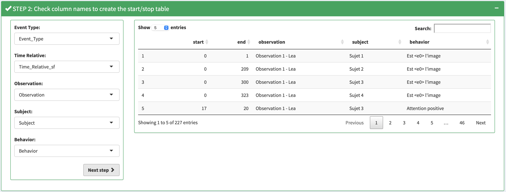

<!-- README.md is generated from README.Rmd. Please edit that file -->


# onoBuilder

<!-- badges: start -->

[](https://lifecycle.r-lib.org/articles/stages.html#stable)
[](https://CRAN.R-project.org/package=onoBuilder)
<!-- badges: end -->

This is a tool to use on R with which you can convert qualitative data
to quantitative data (in occurrences/non-occurrences - ono) to make a
frequency profile analysis. Basically, it was created for files
extracted from The Observer. But you can import any csv or excel file.

## Installation

You can install onoBuilder from [GitHub](https://github.com/) with:

``` r
# install.packages("devtools")
devtools::install_github("thbgrb/onoBuilder")
```

## How to run onoBuilder ?

``` r
library(runOno)
onoBuilder::runOno()
```

## Use onoBuilder to convert files

### Step 1

-   Browse a **csv** or an **excel** file in your computer.


-   If you import a csv file you can configure specifications of the
    file.


-   You can visualize content of the data on the right.



### Step 2

-   Configure columns name, and then, click on the **next step** button.

-   A start/stop table is created and you can visualize it.



### Step 3

-   By default, all observations, all subjects and all behaviors are
    selected. You can change this in the box.

-   Finally, you can download ono files on your computer by clicking on
    **save your files** button.


## Do the Frequency Profile analysis

You have to run the frequency profile tool on R

``` r
require(FreqProf)
FreqProf::runEx()
```

Then, you can use ono files downloaded in FreqProf.
